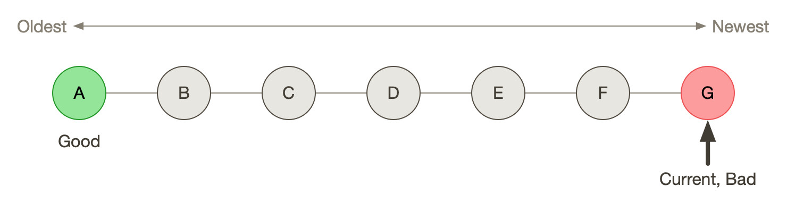
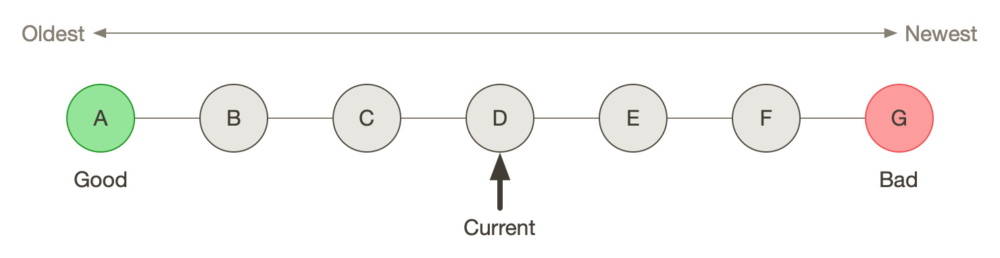
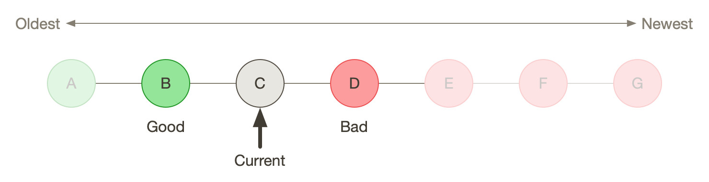
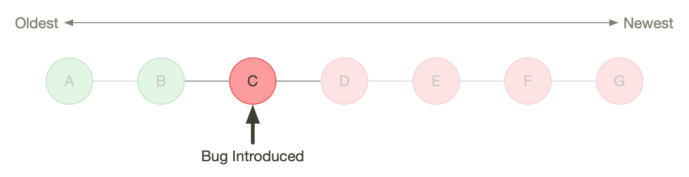
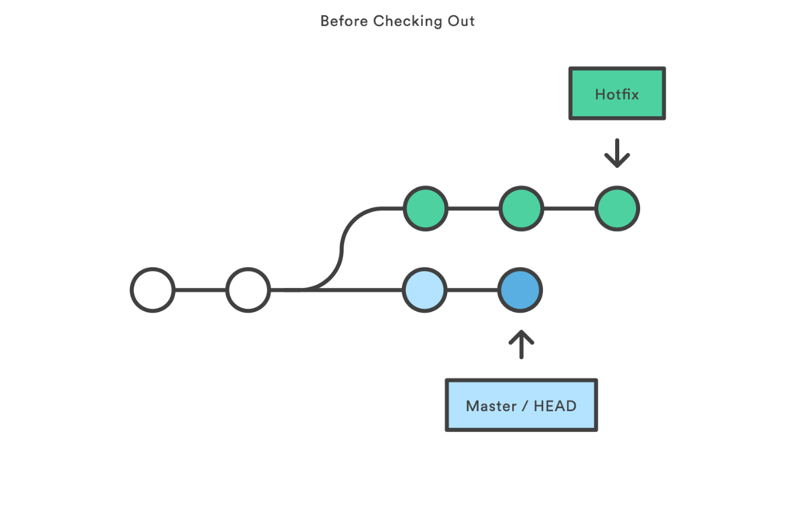
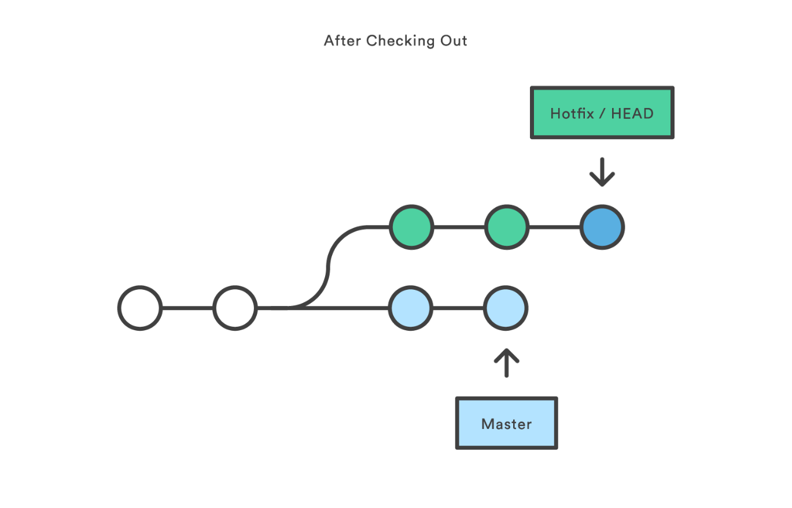
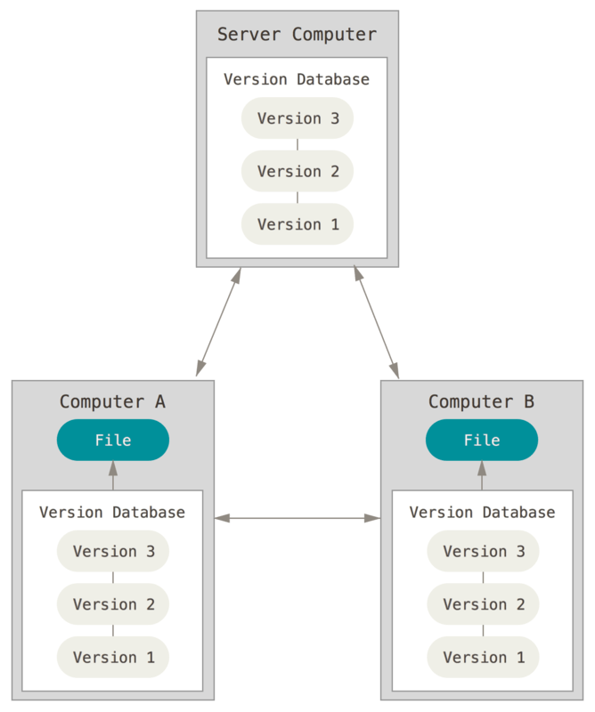

- [<span class="toc-section-number">1</span> Installation instructions](#installation-instructions)
- [<span class="toc-section-number">2</span> Unix Shell](#unix-shell)
  - [<span class="toc-section-number">2.1</span> Intro comments about "shell"](#intro-comments-about-shell)
  - [<span class="toc-section-number">2.2</span> Very brief Bash intro](#very-brief-bash-intro)
- [<span class="toc-section-number">3</span> Why are we here?](#why-are-we-here)
  - [<span class="toc-section-number">3.1</span> Create and revisit a history of project snapshots](#create-and-revisit-a-history-of-project-snapshots)
  - [<span class="toc-section-number">3.2</span> Determine when a bug was introduced](#determine-when-a-bug-was-introduced)
  - [<span class="toc-section-number">3.3</span> Git helps you…](#git-helps-you)
- [<span class="toc-section-number">4</span> Setup](#setup)
  - [<span class="toc-section-number">4.1</span> Inspect your configuration](#inspect-your-configuration)
  - [<span class="toc-section-number">4.2</span> Identify yourself](#identify-yourself)
  - [<span class="toc-section-number">4.3</span> Editor](#editor)
  - [<span class="toc-section-number">4.4</span> Updating remotes](#updating-remotes)
  - [<span class="toc-section-number">4.5</span> (Optional) Change name of default branch](#optional-change-name-of-default-branch)
  - [<span class="toc-section-number">4.6</span> (Optional) Line Endings](#optional-line-endings)
- [<span class="toc-section-number">5</span> Creating a repository](#creating-a-repository)
  - [<span class="toc-section-number">5.1</span> Create a directory](#create-a-directory)
  - [<span class="toc-section-number">5.2</span> Tell Git to make a repository](#tell-git-to-make-a-repository)
  - [<span class="toc-section-number">5.3</span> Check status (we will do this a lot)](#check-status-we-will-do-this-a-lot)
- [<span class="toc-section-number">6</span> Tracking changes](#tracking-changes)
  - [<span class="toc-section-number">6.1</span> Add a file](#add-a-file)
  - [<span class="toc-section-number">6.2</span> Commit cycle](#commit-cycle)
  - [<span class="toc-section-number">6.3</span> Getting help](#getting-help-1)
  - [<span class="toc-section-number">6.4</span> First stage, then commit](#first-stage-then-commit)
  - [<span class="toc-section-number">6.5</span> View commit history in the log](#view-commit-history-in-the-log)
  - [<span class="toc-section-number">6.6</span> Show changes to Workspace and Index](#show-changes-to-workspace-and-index)
  - [<span class="toc-section-number">6.7</span> What goes in a commit?](#what-goes-in-a-commit)
  - [<span class="toc-section-number">6.8</span> Directories aren't content](#directories-arent-content)
- [<span class="toc-section-number">7</span> Exploring history](#exploring-history)
  - [<span class="toc-section-number">7.1</span> Add more text to Workspace](#add-more-text-to-workspace)
  - [<span class="toc-section-number">7.2</span> View subsets of project history](#view-subsets-of-project-history)
  - [<span class="toc-section-number">7.3</span> `diff` using a commit ID instead of the HEAD offset](#diff-using-a-commit-id-instead-of-the-head-offset)
  - [<span class="toc-section-number">7.4</span> Restore the Workspace to a clean state](#restore-the-workspace-to-a-clean-state)
- [<span class="toc-section-number">8</span> Moving through time](#moving-through-time)
  - [<span class="toc-section-number">8.1</span> Check out an old version of a file](#check-out-an-old-version-of-a-file)
  - [<span class="toc-section-number">8.2</span> Don't lose your head](#dont-lose-your-head)
  - [<span class="toc-section-number">8.3</span> (Optional) Levels of undo](#optional-levels-of-undo)
- [<span class="toc-section-number">9</span> Ignoring Things](#ignoring-things)
  - [<span class="toc-section-number">9.1</span> Create some output files](#create-some-output-files)
  - [<span class="toc-section-number">9.2</span> Create .gitignore](#create-.gitignore)
  - [<span class="toc-section-number">9.3</span> Add ignore criteria to your .gitignore file](#add-ignore-criteria-to-your-.gitignore-file)
- [<span class="toc-section-number">10</span> Branching and merging](#branching-and-merging)
  - [<span class="toc-section-number">10.1</span> Create a new branch and switch to it](#create-a-new-branch-and-switch-to-it)
  - [<span class="toc-section-number">10.2</span> Create a new file](#create-a-new-file)
  - [<span class="toc-section-number">10.3</span> Switch back to master and merge](#switch-back-to-master-and-merge)
- [<span class="toc-section-number">11</span> Github](#github)
  - [<span class="toc-section-number">11.1</span> Git != Github](#git-github)
  - [<span class="toc-section-number">11.2</span> Github authentication with SSH](#github-authentication-with-ssh)
  - [<span class="toc-section-number">11.3</span> Set up new repository](#set-up-new-repository)
  - [<span class="toc-section-number">11.4</span> Configure remotes and push from local](#configure-remotes-and-push-from-local)
  - [<span class="toc-section-number">11.5</span> Check that you are up to date](#check-that-you-are-up-to-date)
  - [<span class="toc-section-number">11.6</span> Notes](#notes)
  - [<span class="toc-section-number">11.7</span> (Optional) Working with remotes is a generalization of branch merging](#optional-working-with-remotes-is-a-generalization-of-branch-merging)
- [<span class="toc-section-number">12</span> Local conflicts](#local-conflicts)
  - [<span class="toc-section-number">12.1</span> Create and edit a "pepper" branch](#create-and-edit-a-pepper-branch)
  - [<span class="toc-section-number">12.2</span> Switch back to main branch and create a conflicting edit](#switch-back-to-main-branch-and-create-a-conflicting-edit)
  - [<span class="toc-section-number">12.3</span> Attempt to merge "pepper" branch](#attempt-to-merge-pepper-branch)
  - [<span class="toc-section-number">12.4</span> Resolve conflicts and create commit](#resolve-conflicts-and-create-commit)
  - [<span class="toc-section-number">12.5</span> (Optional) Escaping a bad merge](#optional-escaping-a-bad-merge)
- [<span class="toc-section-number">13</span> (Optional) Collaborating](#optional-collaborating)
  - [<span class="toc-section-number">13.1</span> Clone your repository](#clone-your-repository)
  - [<span class="toc-section-number">13.2</span> Edit trees.txt](#edit-trees.txt)
  - [<span class="toc-section-number">13.3</span> Update and push](#update-and-push)
  - [<span class="toc-section-number">13.4</span> Collaboration models](#collaboration-models)
- [<span class="toc-section-number">14</span> (Optional) Collaboration conflicts](#optional-collaboration-conflicts)
  - [<span class="toc-section-number">14.1</span> Person 1 edits ~/Desktop/garden/shopping_list.txt](#person-1-edits-desktopgardenshopping_list.txt)
  - [<span class="toc-section-number">14.2</span> Person 2 edits ~/Desktop/garden-clone/shopping_list.txt *without* pulling](#person-2-edits-desktopgarden-cloneshopping_list.txt-without-pulling)
  - [<span class="toc-section-number">14.3</span> Edit conflict, stage, commit, and push](#edit-conflict-stage-commit-and-push)
- [<span class="toc-section-number">15</span> Version control with Python source vs. iPython notebooks](#version-control-with-python-source-vs.-ipython-notebooks)
- [<span class="toc-section-number">16</span> Git command summary](#git-command-summary)
- [<span class="toc-section-number">17</span> Graphical User Interfaces](#graphical-user-interfaces)
  - [<span class="toc-section-number">17.1</span> Pro](#pro)
  - [<span class="toc-section-number">17.2</span> Cons](#cons)
- [<span class="toc-section-number">18</span> Next steps (intermediate Git)](#next-steps-intermediate-git)
  - [<span class="toc-section-number">18.1</span> Useful commands](#useful-commands)
  - [<span class="toc-section-number">18.2</span> Restore, Revert, and Reset](#restore-revert-and-reset)
  - [<span class="toc-section-number">18.3</span> Dangerous but useful commands](#dangerous-but-useful-commands)
  - [<span class="toc-section-number">18.4</span> Dangerous commands you should avoid](#dangerous-commands-you-should-avoid)
  - [<span class="toc-section-number">18.5</span> Team-wide strategies](#team-wide-strategies)
- [<span class="toc-section-number">19</span> Credits](#credits)
- [<span class="toc-section-number">20</span> References](#references)

# Installation instructions

1.  Up-to-date installation instructions for Git and Bash are available here: <https://libguides.ucmerced.edu/software-carpentry/git/install>
2.  Create a Github account here: <https://github.com/>
3.  Download Github Desktop: <https://desktop.github.com>

# Unix Shell

## Intro comments about "shell"

- Broadly speaking, there is a tension between making computer systems fast and making them easy to use.
- A common solution is to create a 2-layer architecture: A fast, somewhat opaque core surrounded by a more friendly scriptable interface (also referred to as "hooks" or an "API"). Examples of this include video games, Emacs and other highly customizable code editors, and high-level special-purpose languages like Stata and Mathematica.
- Unix shell is the scriptable **shell** around the operating system. It provides a simple interface for making the operating system do work, without having to know exactly how it accomplishes that work.

## Very brief Bash intro

### File system layout

- Minimal example: <https://swcarpentry.github.io/shell-novice/02-filedir/index.html>
- "directory" == folder
- Your files are in "/home/\<your login\>"or "/Users/\<your login\>"
- Trees are upside-down in computer science

### Who are you?

``` bash
whoami
```

### Where are you?

``` bash
pwd                             # Print Working Directory
```

### What's in this directory?

Command flags modify what a command does.

``` bash
ls                              # List directory contents
ls -a                           # ... and include hidden files
```

### Getting help

``` bash
man ls                          # Manual for "ls"
ls --help                       # In-line help info; should work in Windows
```

- You can navigate through the man page using the space bar and arrow keys
- Quit man with "q"
- Online references are available for Windows users who don't have man pages: <https://linux.die.net/>

### Changing directories

When a command is followed by an argument, it acts on that argument.

``` bash
cd Desktop
ls *.pdf                        # List all files ending in ".pdf"
cd ..                           # go up one directory
```

### History and pipes

The terminal saves your command history (typically 500 or 1000 commands)

- You can see previous commands using the up/down arrows
- You can edit the command that's currently visible and run it

Once your command history gets big, you might want to search it:

``` bash
history
history | grep ls               # pipe the output of history into search
```

# Why are we here?

## Create and revisit a history of project snapshots

<figure id="Snapshot History">

<figcaption>Git creates a history of code snapshots. If you haven't updated a file since your previous snapshot, Git will re-use the old version of that file to save space (<a href="https://git-scm.com/">https://git-scm.com/</a>).</figcaption>
</figure>

## Determine when a bug was introduced









## Git helps you…

- Move backwards and forwards in time using save points in your code history.
- Control what goes into a save point
- Collaborate
- Explore alternative versions of your project without destroying prior work
- Useful for text files, less useful for binary files (most of the useful features are text-oriented)

# Setup

## Inspect your configuration

``` bash
git config --list                   # or -l
git config --list --show-origin     # where is this setting coming from?
```

## Identify yourself

All git commands are 2-part verbs, followed by flags and arguments. Use quotes if you have spaces in your arguments (e.g. user name):

``` bash
git config --global user.name "Gilgamesh"
git config --global user.email gilgamesh@uruk.gov
```

## Editor

You can use any text editor, but you want a sensible default in case Git opens one for you:

``` bash
git config --global core.editor nano
```

## Updating remotes

1.  Only push the current branch (more about this later):

    ``` bash
    git config --global push.default simple
    ```

2.  Merge, don't rebase (more about this later):

    ``` bash
    git config --global pull.rebase false
    ```

## (Optional) Change name of default branch

``` bash
git config --global init.defaultBranch main
```

## (Optional) Line Endings

This advice is probably superseded; see comments at the end of this document. GitBash will automatically set this on Windows machines, but we shouldn't waste class time on it.

``` bash
git config --global core.autocrlf input  # Unix and MacOS
git config --global core.autocrlf true   # Windows
```

# Creating a repository

We are going to create and track plans for our garden.

## Create a directory

``` bash
cd ~/Desktop
mkdir garden
cd garden
```

## Tell Git to make a repository

``` bash
git init
ls
ls -a
```

<figure id="Workspace or Working Tree">

<figcaption>Base your new work on the most recent snapshot.</figcaption>
</figure>

- Git uses this special subdirectory to store all the information about the project, including all files and sub-directories located within the project's directory. If we ever delete the \`.git\` subdirectory, we will lose the project's history.
- Only one version of a file is visible; the rest are available in the database

## Check status (we will do this a lot)

``` bash
git status
```

# Tracking changes

You can edit with nano or with the text editor of your choice. We'll try to show the editor and the command line side-by-side.

## Add a file

``` bash
touch shopping_list.txt
nano shopping_list.txt
```

``` example
##--- text file ---##

1. Cherry tomatoes
```

Save and quit. You can verify that you've saved your changes in Bash:

``` bash
ls
cat shopping_list.txt
```

## Commit cycle

Manually assemble your next save point in the Staging area ("Index"). When you're happy with it, commit it to the repository to create a new version of your project.

<figure id="First Commit">

<figcaption>Build a new save point ("commit") in the Staging Area.</figcaption>
</figure>

<figure id="Commit with multiple files">

<figcaption>Commits include additions and deletions</figcaption>
</figure>

``` bash
git status
git add shopping_list.txt
git status
git commit -m "Start shopping list for garden"
git status
```

- Commit messages should be useful; eventually there will be a lot of them (we'll come back to this)
- There are multiple synonym for each of these locations:
  - Workspace or Working Tree
  - Staging Area, Index, or Cache
  - Repository or Commit History

## Getting help

``` bash
# Concise help
git add -h

# Verbose help
man git-add
```

## First stage, then commit

1.  Edit the file

    ``` example
    ##--- text file ---##

    1. Cherry tomatoes
    2. Italian basil
    ```

    ``` bash
    git status
    git diff
    ```

2.  If you try to commit the file before you add it to the Staging area, nothing happens

    ``` bash
    git commit -m "Add basil"
    git status
    ```

3.  You have to add the file to the Staging area, then commit

    ``` bash
    git add shopping_list.txt
    git commit -m "Add basil"
    ```

## View commit history in the log

``` bash
git log
git log --oneline
```

1.  You can identify a commit by unique ID or by HEAD offset (H, HEAD~1, HEAD~2,…)
2.  HEAD is a pointer to the most recent commit (of the active branch)

### (Optional) Additional log options

``` bash
git log --oneline --graph       # Useful if you have many branches
git log --author=~Gilgamesh
git log --since=5.days          # or weeks, months, years
```

## Show changes to Workspace and Index

1.  Edit the file

    ``` example
    ##--- text file ---##

    1. Cherry tomatoes
    2. Italian basil
    3. Jalapenos
    ```

2.  By default, `diff` shows changes to Workspace

    ``` bash
    git status
    git diff
    ```

3.  Once the file is added to Staging, `diff` no longer shows changes

    ``` bash
    git add shopping_list.txt
    git status
    git diff
    ```

4.  You can examine Staging instead

    ``` bash
    git diff --staged               # or "--cached"
    git commit -m "Add peppers"
    git status
    ```

## What goes in a commit?

1.  Staging area is for creating sensible commits. You can edit multiple files and only add a subset of them to a given commit. This makes it easier to look back at your work.
2.  A commit should be a coherent functional chunk (whatever that means). One way to think about it: If you wanted to cleanly undo your work, what would that look like?

## Directories aren't content

1.  Try to commit an empty directory

    ``` bash
    mkdir flowers
    git status
    git add flowers
    git status
    ```

2.  Now add files and try again

    ``` bash
    touch flowers/roses flowers/tulips
    git status
    git add flowers
    git commit -m "Initial thoughts on flowers"
    ```

# Exploring history

## Add more text to Workspace

``` example
##--- text file ---##

1. Cherry tomatoes
2. Italian basil
3. Jalapenos
4. Cayenne peppers
```

## View subsets of project history

``` bash
# NB: This is identical to "git diff" with no argument
# git diff HEAD shopping_list.txt

# Show all changes back to this point
# HEAD~1 doesn't have text changes - added directory
git diff HEAD~1 shopping_list.txt
git diff HEAD~3 shopping_list.txt

# Show changes for just HEAD~3
git show HEAD~3 shopping_list.txt

# Show changes in range of commits
git diff HEAD~3..HEAD~1 shopping_list.txt
```

### (Optional) Range syntax also works for logs

``` bash
git log HEAD~3..HEAD~1
```

## `diff` using a commit ID instead of the HEAD offset

``` bash
# Theoretically you can do this
# git diff f22b25e3233b4645dabd0d81e651fe074bd8e73b shopping_list.txt

# Use reduced 7-character ID from "git log --oneline"
git diff f22b25e shopping_list.txt
```

## Restore the Workspace to a clean state

``` bash
# We have unstaged changes
git status

# Revert the working tree to the most recent commit
git restore shopping_list.txt

# Check whether your editor is automatically updating!
cat shopping_list.txt

# The old way of doing it:
# git checkout HEAD shopping_list.txt
```

# Moving through time

## Check out an old version of a file

<figure id="Checkout">

<figcaption>Check out an old commit to view it</figcaption>
</figure>

``` bash
# Using the HEAD offset:
git checkout HEAD~3 shopping_list.txt

# Alternatively, you can use the commit ID:
#git checkout f22b25e shopping_list.txt

# View the changed file in the Working Tree
cat shopping_list.txt

# These changes are also in the Staging area; you can create a new commit
# that includes the older file version.
git status
git diff
git diff --staged

# Go back to the most recent version
git restore shopping_list.txt

# The old way:
#git checkout HEAD shopping_list.txt
```

**Instructor's note:** Update drawing with files moving in and out of working tree/staging area

## Don't lose your head

What if you want to see a previous version of the whole project?

``` bash
# Detached HEAD moves the whole HEAD pointer back to an earlier version
git checkout HEAD~2
git status
git log --oneline

# Move HEAD back to latest commit by checking out the branch name
git checkout master
```

**Instructor's note:** Update drawing with moving HEAD pointer

- You can also check out a tag.
- Unfortunately some of these terms, like "checkout", are overloaded. Think about what you want to do to your history, then look up the appropriate command.

## (Optional) Levels of undo

1.  Restore (or checkout HEAD)

    ``` bash
    git restore <filename>
    ```

    ``` bash
    git restore --staged <filename>
    git restore <filename>
    ```

2.  Revert

    ``` bash
    git revert -n HEAD
    git revert --continue
    ```

3.  Reset moves the HEAD

    ``` bash
    git reset --soft HEAD
    git status
    # git add
    # git commit
    git restore .
    ```

    ``` bash
    git reset --mixed HEAD
    git status
    # git commit
    git restore .
    ```

    ``` bash
    git reset --hard HEAD
    git status
    git log --oneline

    # Are you behind the remote?
    ```

# Ignoring Things

Git allows project-specific configuration via .gitignore and .gitattributes.

## Create some output files

``` bash
mkdir results
touch a.dat b.dat c.dat results/a.out results/b.out
ls
git status
```

## Create .gitignore

``` bash
touch .gitignore
ls -a
```

## Add ignore criteria to your .gitignore file

``` example
##--- text file ---##

*.dat
results/
```

``` bash
# We are ignoring .dat files and tracking .gitignore
git status
git add .gitignore
git commit -m "Ignore output files"
```

- Ignoring complicated directory structures can be tricky, come talk to me
- You should generally ignore archives (zip, tar), images (png, jpg), binaries (dmg, iso, exe), compiler output, log files, and .DS_Store (Mac)

# Branching and merging

<figure id="Branching and Merging">

<figcaption>Git branching and Merging (<a href="https://imgur.com/gallery/YG8In8X/new">https://imgur.com/gallery/YG8In8X/new</a>)</figcaption>
</figure>

## Create a new branch and switch to it

<figure id="Main branch">

<figcaption>Check out the branch to work on it (1)</figcaption>
</figure>

<figure id="Feature branch">

<figcaption>Check out the branch to work on it (2)</figcaption>
</figure>

``` bash
# Create a new branch
git branch feature

# Show all branches
git branch

# Switch to new branch
git switch feature
git branch
git status
```

## Create a new file

``` bash
touch feature.txt
nano feature.txt
```

``` example
##--- text file ---##

This is a new feature we're trying out
```

``` bash
git status
git add feature.txt
git commit -m "Added a trial feature"
```

## Switch back to master and merge

<figure id="Pre-merge history">

<figcaption>Pre-merge history</figcaption>
</figure>

<figure id="Post-merge history">

<figcaption>Post-merge history</figcaption>
</figure>

``` bash
# File doesn't exist on the master branch
git switch master
ls

# Merging the feature branch adds your changes
git merge feature
ls
```

- This is simplest possible case: All of the new changes were in one branch (Fast-Forward merge moves branch tag)
- A branch history with competing changes is shown in the Conflicts section below (Recursive merge, which resembles the octopus diagram)

# Github

<figure id="Pre-merge state">

<figcaption>Coordinate with co-authors.</figcaption>
</figure>

## Git != Github

- easy collaboration
- sync between machines
- off-site backup
- peer review

## Github authentication with SSH

### Create a new public key pair

1.  Open Terminal (Mac/Linux) or Powershell (Windows) and run the following command:

    ``` bash
    # Creates an ed25519 key pair by default
    ssh-keygen -C "your email"
    ```

2.  Press **Enter** to accept the default key name

3.  Enter a password and press **Enter**

4.  The new key pair will appear in **\$HOME/.ssh**

### Add the public key to Github

1.  Log into Github (<https://github.com>) and navigate to <https://github.com/settings/keys>

2.  Click **New SSH Key**

3.  Copy the text of the public key **\$HOME/.ssh/id_ed25519.pub** ("id_ed25519.pub" is the default name for the public key; if you chose a different name when you created it, the file will be called that instead). You can do this by opening the file in a text editor such as Notepad, or by echoing the text to the terminal:

    ``` bash
    cat ~/.ssh/id_ed25519.pub
    ```

4.  Paste the key text into the "Key" field on Github.

5.  Click **Add SSH key**

## Set up new repository

1.  Create new repository (visual instructions here: <https://swcarpentry.github.io/git-novice/07-github.html>)
2.  Call it "garden"
3.  Copy the SSH string that identifies repository

## Configure remotes and push from local

``` bash
git remote add origin git@github.com:devnich/garden.git
git remote -v
git push origin main
```

If you configure your origin as upstream, you can just do:

``` bash
git push
```

## Check that you are up to date

`pull` is a shortcut for `fetch` + `merge`

``` bash
git pull
```

## Notes

1.  The local version of your repository and the Github version are separate. They're only in sync when you explicitly sync them.
2.  We will periodically check the our local version against the Github version and sync them as necessary.

## (Optional) Working with remotes is a generalization of branch merging

1.  git pull merges origin/master branch into local master branch
2.  git push merges local master branch into origin/master branch
3.  Under the hood, pull is fetch + merge
    1.  fetch gets updates from remote
    2.  Local repository has a 2 branches: remote/master and master
    3.  merge merges remote/master into master

# Local conflicts

## Create and edit a "pepper" branch

``` bash
git branch pepper
git switch pepper
```

``` example
##--- text file ---##

1. Cherry tomatoes
2. Italian basil
3. Jalapenos
4. Cayenne peppers
```

``` bash
git add shopping_list.txt
git commit -m "Added peppers to pepper branch"
```

## Switch back to main branch and create a conflicting edit

``` bash
git switch master
```

``` example
##--- text file ---##

1. Cherry tomatoes
2. Italian basil
3. Jalapenos
4. Garlic
```

``` bash
git add shopping_list.txt
git commit -m "Added garlic to main branch"
```

## Attempt to merge "pepper" branch

``` bash
git merge pepper
```

## Resolve conflicts and create commit

Edit the file to resolve the conflict. You can delete one of the two lines, combine them, or make any other changes. Delete the conflict markers before staging the file (the lines beginning in "\<", "=", and "\>").

``` example
##--- text file ---##

<<<<<<< HEAD
4. Garlic
=======
4. Cayenne peppers
>>>>>>> dabb4c8c450e8475aee9b14b4383acc99f42af1d
```

``` bash
git add shopping_list.txt
git commit -m "Added garlic to main branch"
```

## (Optional) Escaping a bad merge

``` bash
# Option 1 (preferred)
git merge --abort

# Option 2 (destructive)
git reset --hard HEAD
```

# (Optional) Collaborating

**Instructor's note:** Demo this section with two terminal windows, one for "garden" and one for "garden-clone"

## Clone your repository

``` bash
git clone https://github.com/devnich/garden.git ~/Desktop/garden-clone
cd garden-clone
touch trees.txt
```

## Edit trees.txt

``` example
##--- text file ---##

1. Plum
2. Pluot
3. Aprium
```

## Update and push

``` bash
pwd                             # we are in ~/Desktop/garden-clone
git status
git add trees.txt
git commit -m "I like plums"
git push
cd ../garden                   # now we are in ~/Desktop/garden
ls
git pull
ls
```

## Collaboration models

cf. <https://docs.github.com/en/pull-requests/collaborating-with-pull-requests/getting-started/about-collaborative-development-models>

### Shared Repository workflow

1.  Clone repository
2.  Create new branch
3.  Push branch to shared repository
4.  Request merge

### Fork-and-Pull workflow

1.  Fork repository
2.  Clone forked repository
3.  Create branch (optional)
4.  Push changes to forked repository
5.  Create pull request for original repository

# (Optional) Collaboration conflicts

## Person 1 edits ~/Desktop/garden/shopping_list.txt

``` example
##--- text file ---##

1. Cherry tomatoes
2. Italian basil
3. Jalapenos
4. Scotch bonnet peppers
```

``` bash
git add shopping_list.txt
git commit -m "Added more peppers our copy"
git push origin master
```

## Person 2 edits ~/Desktop/garden-clone/shopping_list.txt *without* pulling

``` example
##--- text file ---##

1. Cherry tomatoes
2. Italian basil
3. Jalapenos
4. Garlic
```

``` bash
git add shopping_list.txt
git commit -m "Added garlic to rival copy"

# Rejected because Git can't merge changes cleanly
git push origin master

# Pulling results in a local conflict
git pull origin master
```

## Edit conflict, stage, commit, and push

Edit the file to resolve the conflict. You can delete one of the two lines, combine them, or make any other changes. Delete the conflict markers before staging the file (the lines beginning in "\<", "=", and "\>").

``` example
##--- text file ---##

<<<<<<< HEAD
4. Garlic
=======
4. Cayenne peppers
>>>>>>> dabb4c8c450e8475aee9b14b4383acc99f42af1d
```

You may want to enable a default merge tool:

``` bash
git config --global merge.tool meld
```

- Open source merge tools include Vimdiff, Meld, Kdiff, Gitfiend, Git Cola, etc. There are many other options!
- Always pull before you push
- To minimize conflicts, do your work on a separate branch

# Version control with Python source vs. iPython notebooks

.ipynb files contain a lot of JSON boilerplate that isn't code

# Git command summary

Git commands are about moving stuff between trees: <https://ndpsoftware.com/git-cheatsheet.html>

# Graphical User Interfaces

## Pro

1.  Viewing history is a much better experience

## Cons

1.  Not fully functional (missing commands and command options)
2.  Git is still complicated. Menus and buttons don’t change that.
3.  Accidental button presses are scary

# Next steps (intermediate Git)

## Useful commands

- `git blame`: See who changed each line of a file
- `git bisect`: Find out when a change was introduced (good man page)
- `git add --patch`: Stage a part of a file ("hunk") instead the entire file
- `git -i <command>`: Run a command interactively, confirming each step

## Restore, Revert, and Reset

Each of these is a different answer to the question, "How do I get back to where I was?" They are listed from least dangerous to most dangerous.

- `git-restore`: Restore files in the working tree from the index or from another commit. This command does not update your branch.
- `git-revert`: Make a new commit that reverts the changes made by other commits (good man page)
- `git-reset`: Update your branch, moving the tip in order to add or remove commits from the branch (i.e. it moves the HEAD pointer around and then takes additional actions base on the options you provide). This operation changes the commit history.

## Dangerous but useful commands

These commands are potentially dangerous because they rewrite history. You should never change or delete history that you have shared with other people.

- `git reset`: Delete uncommitted changes
- `git reset --hard`: Delete some of your commits to get back to an earlier project state. Cannot be undone!
- `git rebase`: Rewrite the history of branch A to include branch B. This is different than merging branch B into branch A; merging retains your project history, whereas rebasing rewrites that history.
- `git squash`: Convert multiple commits into a single commit. This also rewrites your project history.

## Dangerous commands you should avoid

- `git cherry-pick`: Copy a single commit from a different branch. This rewrites your project history piecemeal, which can make it difficult to merge branches in the future.

## Team-wide strategies

Cases where the entire team must adopt the same workflow. Failing to do so will break the project.

### Branching strategies

1.  Topic branch vs long-lived release version
2.  Tags for canonical versions

### Merge strategies (merge vs rebase)

Merge has already been demonstrated. It's the default workflow and preserves all project history. The alternative workflow is Rebase (shared branches) and Squash (private branches).

1.  Rebase

    ``` bash
    git checkout feature
    git rebase main
    git checkout main
    git merge feature
    ```

2.  Squash

    ``` bash
    git rebase -i HEAD~2

    # Then edit action for previous commits to be "squash"
    ```

    ``` bash
    # Can also implicity squash using reset
    git reset --soft HEAD~2
    git commit
    ```

### Github workflows (push vs pull request)

1.  Demo with forked repository
2.  Push is easier with small team
3.  Pull Request implies that repository owner is actually checking work and not just blindly merging
4.  Implies fork vs clone for repository replication

# Credits

1.  <https://dlstrong.github.io/git-novice/>
2.  <https://git-scm.com/book/en/v2>
3.  <https://gitlab.com/liibre/curso/-/wikis/material>
4.  <https://swcarpentry.github.io/git-novice/reference>
5.  <https://swcarpentry.github.io/shell-novice/reference/>
6.  <https://twitter.com/jay_gee>

# References

1.  The Pro Git book: <https://git-scm.com/book/en/v2>
2.  Graphical user interfaces for Git (useful for visualizing diffs and merges): <https://git-scm.com/book/en/v2/Appendix-A%3A-Git-in-Other-Environments-Graphical-Interfaces>
3.  Git for Advanced Beginners: <http://think-like-a-git.net>
4.  "Git is built on a graph. Almost every Git command manipulates this graph. To understand Git deeply, focus on the properties of this graph, not workflows or commands.": <https://codewords.recurse.com/issues/two/git-from-the-inside-out>
5.  A Visual Git Reference: <https://marklodato.github.io/visual-git-guide/index-en.html>
6.  Visual cheat sheet: <https://ndpsoftware.com/git-cheatsheet.html>
